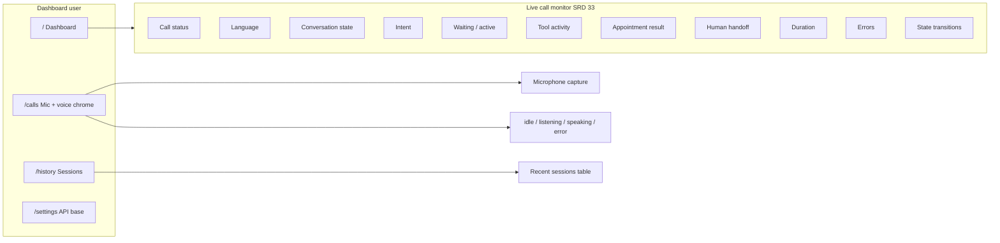

# UI/UX Design — AI Voice Appointment Agent (KAN-19)

Agreed design artifact derived from the [Software Requirements Document](https://docs.google.com/document/d/1bGI6jgH1Plkc328smgSnx6hTI-kzV3XyKLpmrfJ9C_A/edit?usp=sharing) and [KAN-19](https://voiceagentai.atlassian.net/browse/KAN-19).

This document + the implemented screens (demo data) are the handoff for later live-API implementation tickets.

## Primary browser flows

## Screens

| Route | Purpose | SRD coverage |
| ----- | ------- | ------------ |
| `/` | Live monitoring: active call snapshot, voice-state legend, system health, recent calls strip | §33 Dashboard |
| `/calls` | Browser mic capture + voice chrome reference | Voice interaction states |
| `/history` | Past sessions (book / reschedule / cancel / handoff outcomes) | Appointment flows + handoff |
| `/settings` | Resolved `VITE_API_BASE_URL` | Ops |

## Voice UI states (KAN-19 TC-002)

Operator chrome collapses SRD §24 conversation states into four modes:

| Voice UI | Typical SRD states |
| -------- | ------------------ |
| `listening` | `USER_SPEAKING`, `ACTIVE_CONVERSATION`, `INTERRUPTED`, `USER_RETURNED`, `CONFIRMATION_REQUIRED` |
| `speaking` | `AGENT_SPEAKING` |
| `idle` | `WAITING_FOR_USER`, `USER_REQUESTED_WAIT`, `BACKGROUND_SPEECH`, tool/hold/handoff quiet periods |
| `error` | `ERROR_RECOVERY` |

Mapping lives in `src/utils/voiceUi.ts`. Components: `VoiceStateIndicator`, `VoiceStateLegend`.

## Live call monitor fields (SRD §33)

Implemented in `LiveCallMonitor` + `CallActivityTimeline`:

- Current call status, language, conversation state, intent
- Waiting vs active, tool activity, appointment result
- Human handoff status, duration, errors
- Activity log of operational events / state transitions (no private chain-of-thought)

Demo payload: `src/data/demoCallMonitor.ts` (matches the SRD wait → background speech → caller return example).

## Out of scope for this design ticket

- Wiring to real telephony / WebSocket call feeds
- Booking mutations from the UI
- Exposing model chain-of-thought

## Implementation notes for follow-on tickets

1. Replace `DEMO_LIVE_CALL` / `DEMO_RECENT_CALLS` with API or SSE/WebSocket sources.
2. Keep field labels aligned with this monitor so operators retain muscle memory.
3. Preserve the four voice chrome states even if SRD adds more conversation states — extend the mapper only.
