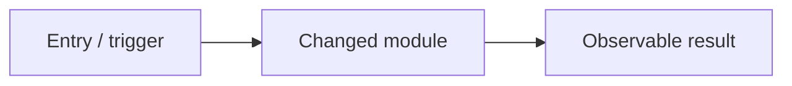

# Branch & Pull Request Workflow

How agents and developers start work, name branches, and open PRs for this repository.

## Before coding

1. **Identify the Jira ticket.**
   - If the user already gave a key (e.g. `KAN-11`), use it.
   - If not, **ask for the Jira ticket number** before creating a branch or committing feature work.
2. Read the ticket (Purpose, High-Level Flow, Test Cases, Acceptance Criteria).
3. Confirm scope matches this **backend** repo (frontend work belongs in the separate frontend repo).

Do not start implementation on `main` for ticketed work. Always use a feature/fix branch.

## During implementation (mandatory)

1. **Check the ticket test cases** (TC-001…) and acceptance criteria before and while coding.
2. **Add or update automated tests** in `tests/` so ticket scenarios are covered (or document why a TC is manual-only).
3. **Update knowledge docs** for every behavioral or structural change:
   - Flows → `SYSTEM_FLOW.md` / `docs/architecture/*` / `docs/voice/*`
   - APIs/services → `docs/backend/*`
   - Schema → `docs/database/*` + migration
   - Config → `.env.example` + README config table + `docs` as needed
   - Process → `docs/process/*`
4. Run `npm test` (and lint when touching TS) before push/PR.

Code without tests (when testable) or without matching docs is incomplete.

## Branch naming

Use a prefix that matches the type of change, then a short kebab-case title derived from the ticket summary.

| Prefix | When to use |
| ------ | ----------- |
| `feat/` | New feature or capability |
| `fix/` | Correcting broken/incorrect behavior (non-urgent or general fix) |
| `bugfix/` | Defect / regression fix (prefer when the ticket is clearly a bug) |

### Format

```text
{prefix}/{jira-key}-{short-title}
```

- `{prefix}`: `feat` | `fix` | `bugfix`
- `{jira-key}`: e.g. `KAN-11` (lowercase key is also fine: `kan-11`)
- `{short-title}`: kebab-case, 3–8 words from the ticket title; no spaces

### Examples

| Ticket | Branch |
| ------ | ------ |
| KAN-11 Implement Speech-to-Text Integration | `feat/KAN-11-speech-to-text-integration` |
| KAN-18 Add Voice Pipeline Logging & Error Handling | `feat/KAN-18-voice-pipeline-logging` |
| Bug: STT returns empty on valid audio | `bugfix/KAN-XX-stt-empty-transcript` |
| Config validation rejects valid DATABASE_URL | `fix/KAN-XX-database-url-validation` |

### Rules

- One ticket → one branch (unless the ticket is split with agreement).
- Do not use vague names like `feat/updates` or `fix/stuff`.
- Do not commit secrets (`.env`, `.cursor/mcp.json`).

## Commits

- Prefer focused commits that match the ticket scope.
- Reference the Jira key in the commit message subject or body when practical, e.g. `feat(stt): wire OpenAI transcription (KAN-11)`.

## Push & pull request

When the work is ready to share (or the user asks to push / open a PR):

1. Push the branch with upstream tracking: `git push -u origin HEAD`
2. **Open a pull request** into `main` (default base unless told otherwise).
3. PR title and branch should stay aligned with the naming convention.
4. **Fill the full PR body** below — do not ship a Summary-only / Test-plan-only stub. Mirror the ticket’s High-Level Flow, Purpose/Scope, and TC-001… checklist. Use repo `.github/pull_request_template.md` when present.

### PR title

```text
{prefix}: {Ticket title} ({JIRA-KEY})
```

Examples:

- `feat: Implement Speech-to-Text Integration (KAN-11)`
- `bugfix: Handle empty STT audio payload (KAN-XX)`
- `fix: Clarify DATABASE_URL validation error (KAN-XX)`

### PR body (required — all sections)

Agents **must** include every section. Thin “Summary + Test plan” bodies are incomplete.

~~~~markdown
## High-level diagram



<!-- Prefer mermaid. ASCII is OK when mermaid is awkward. Match the ticket High-Level Flow. -->

## Description

<!-- What changed and why. Scope in/out. Link Jira. Companion PRs if full-stack. -->

- <what / why>
- Scope in: ...
- Scope out: ...
- Jira: https://voiceagentai.atlassian.net/browse/{KEY}
- Companion PR (if any): <url>

## Test cases

<!-- List every ticket TC (Given/When/Then or short title). Mark automated vs manual. -->

- [ ] TC-001 - <name / given-when-then>
- [ ] TC-002 - ...
- [ ] `npm test` passes (`tests/...` suites touched)
- [ ] Docs updated (list paths)
- [ ] Manual check against acceptance criteria
~~~~

### PR body rules

| Required | Detail |
| -------- | ------ |
| High-level diagram | Mermaid (preferred) or ASCII; same path as the Jira High-Level Flow |
| Description | Why + scope in/out + Jira link; note companion BE/FE PR when full-stack |
| Test cases | Every ticket `TC-00x`, plus `npm test`, docs, and any manual smoke |
| No secrets | No `.env`, keys, or raw provider payloads in the PR body |

Use `gh pr create` / `gh pr edit` with this body. After opening a thin PR by mistake, **edit the body immediately** to match this template.

## After merge

- Move/close the Jira ticket per team process (often **Done** after merge).
- Delete the remote branch if the host does not auto-delete.
- Update [`BACKLOG.md`](BACKLOG.md) status notes if useful.

## Quick checklist for agents

- [ ] Asked for / confirmed Jira ticket key
- [ ] Branch named `feat|fix|bugfix/{KEY}-{short-title}`
- [ ] Ticket test cases checked and covered
- [ ] Automated tests added/updated; `npm test` passes
- [ ] Knowledge docs updated to match the change
- [ ] Implementation matches ticket AC
- [ ] Pushed branch **and** opened PR with matching title
- [ ] PR body has **diagram + description + full TC checklist** (not Summary-only)
- [ ] No secrets in the PR

## Related docs

- [`TICKET_STANDARDS.md`](TICKET_STANDARDS.md)
- [`BACKLOG.md`](BACKLOG.md)
- [`AGENTS.md`](../../AGENTS.md)
