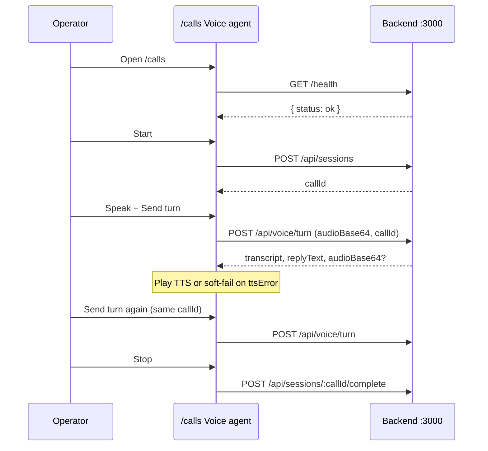

# Sprint 2 E2E runbook (KAN-17)

Prove the full browser voice path: **mic → UI → session → `/api/voice/turn` → transcript + TTS → multi-turn → stop**. No new product UI — wire and verify.

Jira: [KAN-17](https://voiceagentai.atlassian.net/browse/KAN-17)

## Preconditions

| Item | Expected |
| ---- | -------- |
| Frontend | `npm run dev` → [http://localhost:5174/calls](http://localhost:5174/calls) |
| API base | `VITE_API_BASE_URL=http://localhost:3000` (see `.env.example`) |
| Backend | Express up; CORS allows origin `http://localhost:5174` |
| Secrets | Backend STT / LLM / TTS keys + Postgres configured in `voice-agent` |
| Scope | Browser only — **no telephony** |

Companion API cheat sheet: [`docs/backend/API_DOCUMENTATION.md`](../backend/API_DOCUMENTATION.md). Flow: [`SYSTEM_FLOW.md`](../../SYSTEM_FLOW.md), [`docs/architecture/VOICE_PIPELINE.md`](../architecture/VOICE_PIPELINE.md).

## API sequence



## Smoke checklist

| ID | Steps | Pass when |
| -- | ----- | --------- |
| Smoke-1 | Dashboard System Status | Healthy after `GET /health` |
| Smoke-2 | `/calls` → Start | Mic granted; phase listening; Call ID shown |
| Smoke-3 | Speak → Send turn | Transcript + replyText; TTS plays when `audioBase64` present |
| Smoke-4 | Second turn | Same `callId`; context-aware reply; turns list grows |
| Smoke-5 | Soft TTS | `ttsError` → text reply + notice; no crash |
| Smoke-6 | Stop | Idle; mic released; session complete best-effort |
| Smoke-7 | Mic deny / backend 5xx | Error chrome; Resume (same session) or Start again; no shell crash |
| Smoke-8 | Telephony | No dialer / PSTN UI or claims |

## Frontend checklist

- [x] URL `http://localhost:5174/calls` (Vite `strictPort: 5174`)
- [x] Env-driven API base → `http://localhost:3000`
- [x] Health → System Status Healthy (CORS required)
- [x] `POST /api/sessions` → keep `callId`
- [x] Mic clip → `POST /api/voice/turn` with `audioBase64` + `callId`
- [x] Show transcript + `replyText`; play `audioBase64`; soft-fail on `ttsError`
- [x] Turn 2+ reuses `callId`
- [x] Stop → `POST /api/sessions/:callId/complete` → idle
- [x] Recoverable error via **Resume** (keeps `callId`) or fresh **Start** after Stop

## Automated coverage

`tests/VoiceAgentPanel.test.tsx` — TC-001–009 (listen, transcript, TTS, soft/hard errors, stop, multi-turn, mic deny, Resume).

```bash
npm test
```

## Blockers

1. Backend CORS for `http://localhost:5174` (restart BE after CORS fix).
2. STT / LLM / TTS keys + Postgres on backend.
3. KAN-16 voice UI present on `/calls` (this branch includes that wiring).
